# 11 — Diagrammes UML & schémas

Ce document rassemble les diagrammes UML et schémas d'architecture d'AIRI. Les diagrammes sont au format **Mermaid** pour être rendus directement par la plupart des outils (GitHub, VS Code, Obsidian).

## 11.1 Diagramme de déploiement

```mermaid
graph TB
    subgraph Desktop["Desktop Tamagotchi (Electron)"]
        TM[Main Process]
        TR[Renderer Process]
        TS[server-runtime embarqué]
        TM ---|injeca DI| TS
        TM ---|eventa IPC| TR
        TR ---|server-sdk WS| TS
    end

    subgraph Web["Web PWA"]
        WB[Navigateur Vue]
    end

    subgraph Mobile["Mobile Pocket (Capacitor)"]
        MW[WebView Vue]
        MN[Native Bridge Swift/Kotlin]
        MW ---|JS Bridge| MN
    end

    subgraph Cloud["Cloud / LAN"]
        CS[server-runtime Node]
        AS[apps/server (Hono)]
        DB[(PostgreSQL)]
        RD[(Redis)]
    end

    subgraph External["Services externes"]
        DC[Discord]
        TG[Telegram]
        MC[Minecraft server]
        TX[Twitter/X]
        BL[Bilibili Live]
        LLM[LLM providers]
        TTS[TTS providers]
    end

    WB ---|WS direct| CS
    MN ---|WS via native| CS

    CS ---|consumer pattern| DB

    AS ---|auth/chat/flux| DB
    AS ---|sessions| RD

    subgraph Bots
        DB2[discord-bot]
        TB[telegram-bot]
        MB[minecraft-bot]
        TWB[twitter-services]
        BB[bilibili-laplace]
    end

    DB2 -.WS.-> CS
    TB -.WS.-> CS
    MB -.WS.-> CS
    TWB -.WS.-> CS
    BB -.WS.-> CS

    DB2 --> DC
    TB --> TG
    MB --> MC
    TWB --> TX
    BB --> BL

    subgraph LLMPluginHost
        LO[airi-plugin-llm-orchestrator]
    end

    LO -.WS.-> CS
    LO --> LLM
    TS --> LLM
    TS --> TTS
```

## 11.2 Diagramme de classes (server-runtime ↔ server-sdk)

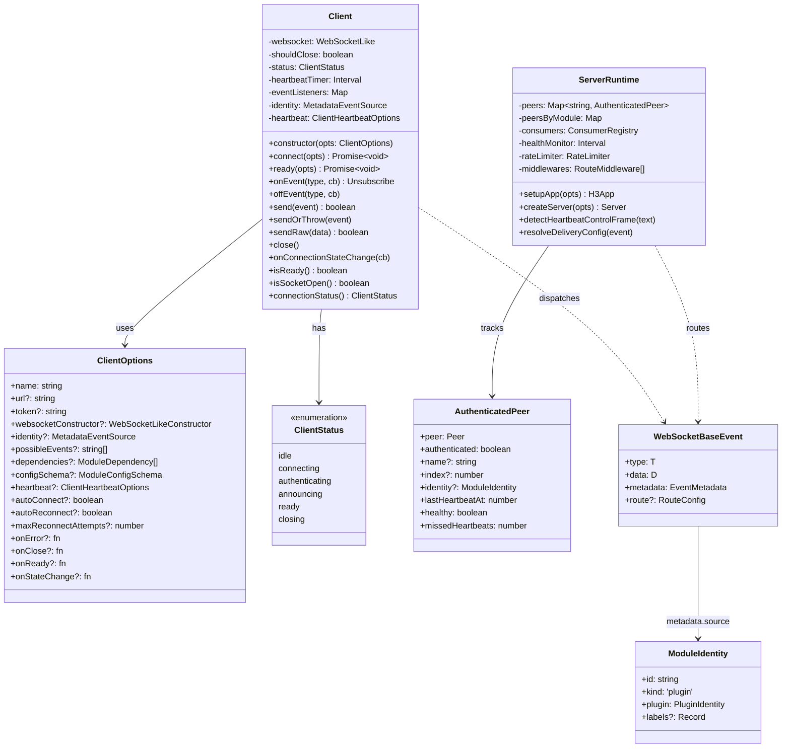

## 11.3 Diagramme de séquence : connexion d'un module

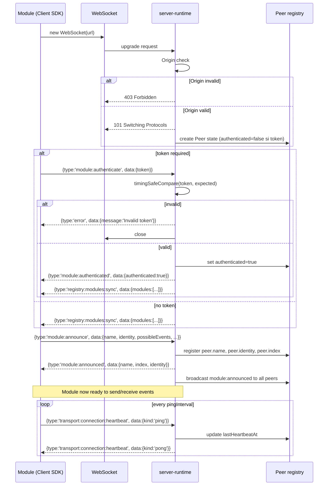

## 11.4 Diagramme de séquence : input vocal complet

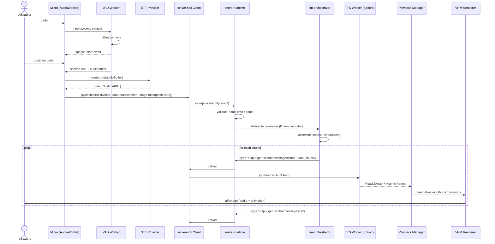

## 11.5 Diagramme d'état : Client SDK connection state

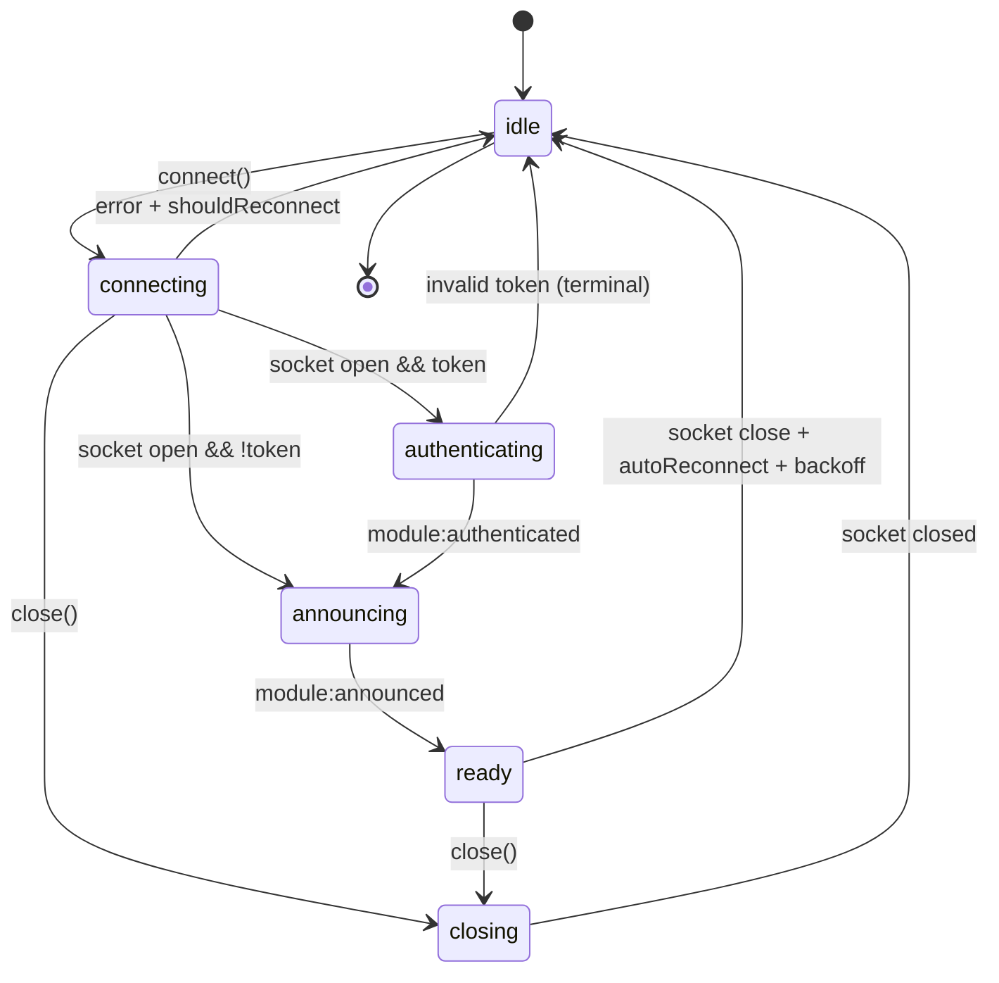

## 11.6 Diagramme de composants : stage-tamagotchi

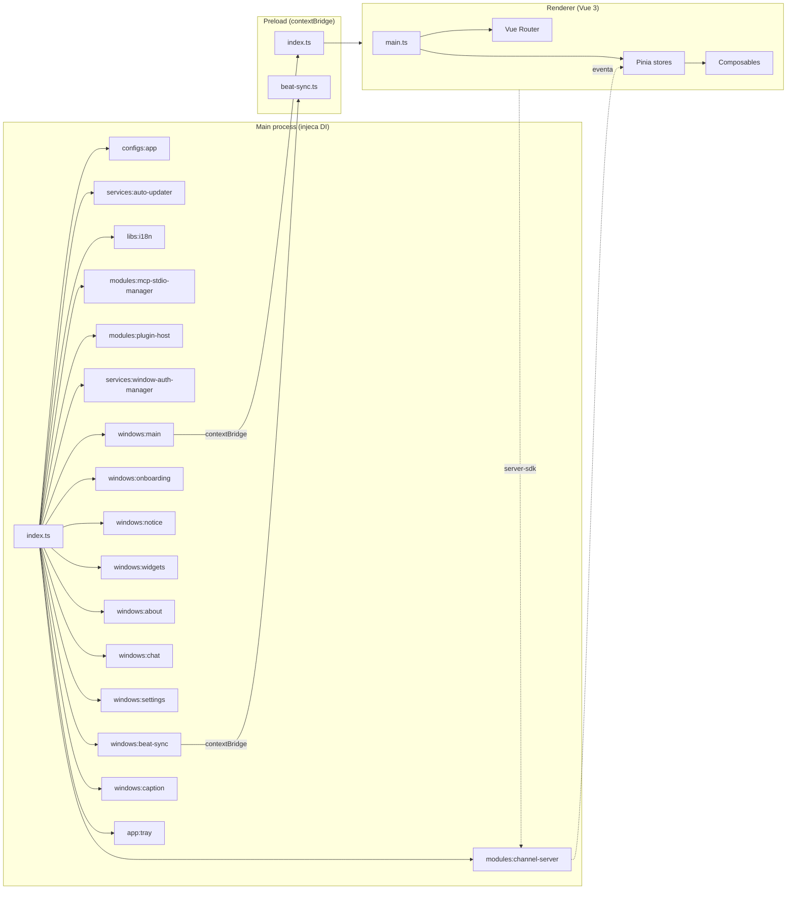

## 11.7 Diagramme de composants : stage-ui (cœur UI)

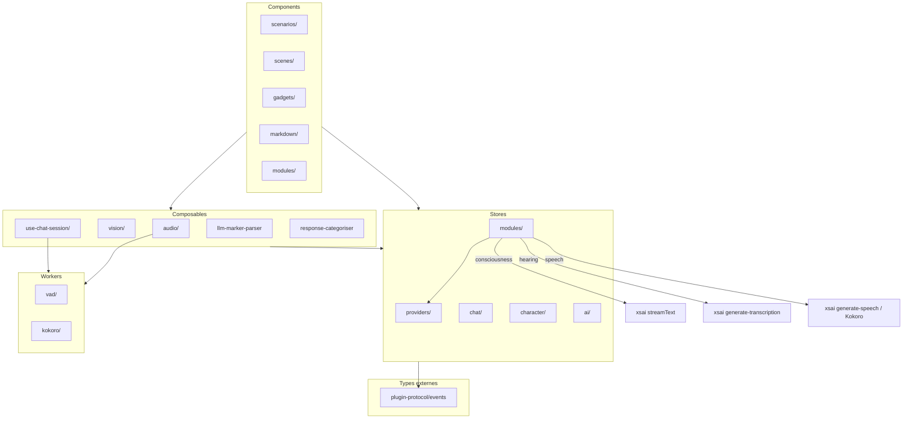

## 11.8 Diagramme de séquence : handshake handshake Electron IPC (eventa)

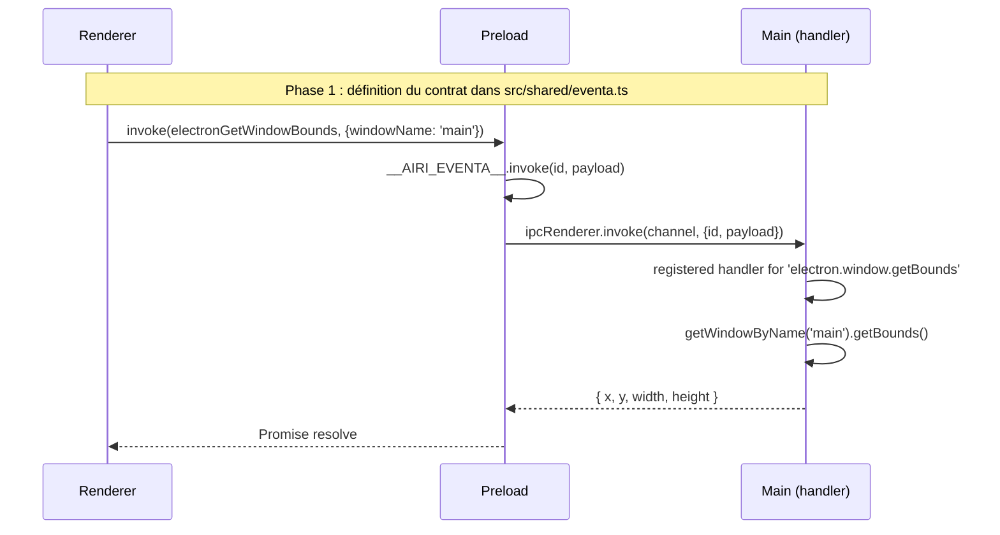

## 11.9 Diagramme de séquence : onboarding QR (client pocket vers runtime local)

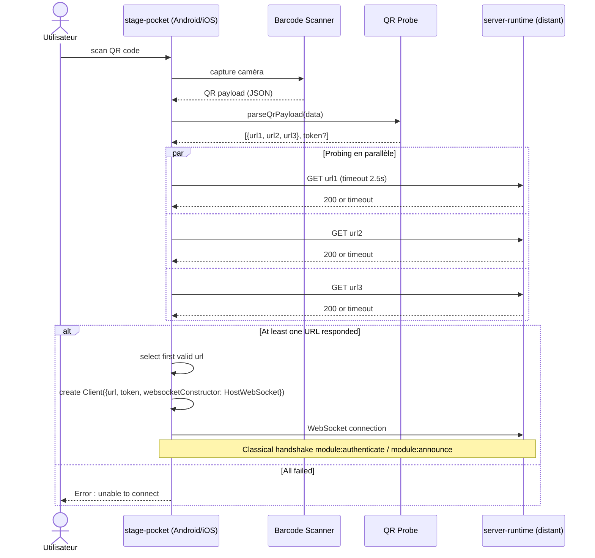

## 11.10 Diagramme d'activités : cycle de vie d'un plugin

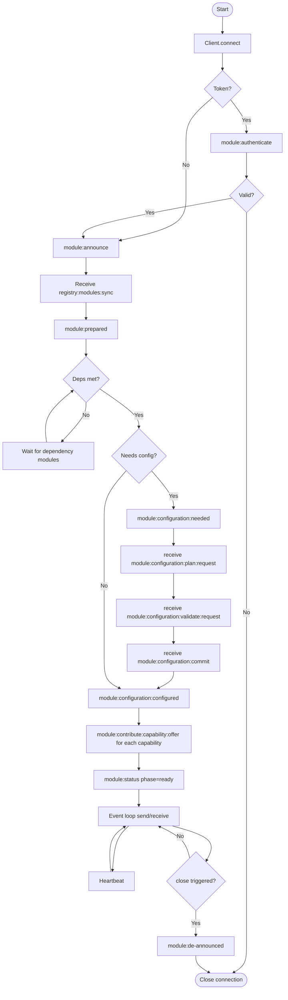

## 11.11 Diagramme de déploiement Electron (multi-fenêtres)

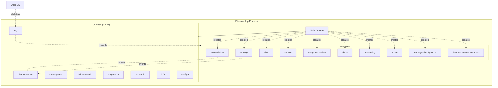

## 11.12 Diagramme Entité-Relation simplifié (apps/server)

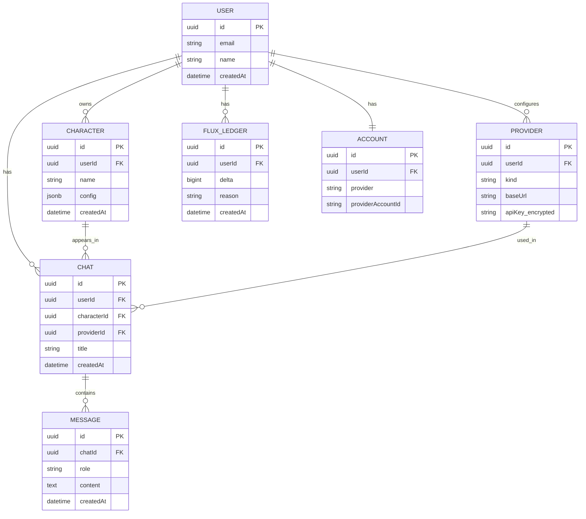

## 11.13 Schéma : arbre d'héritage / dépendances des packages

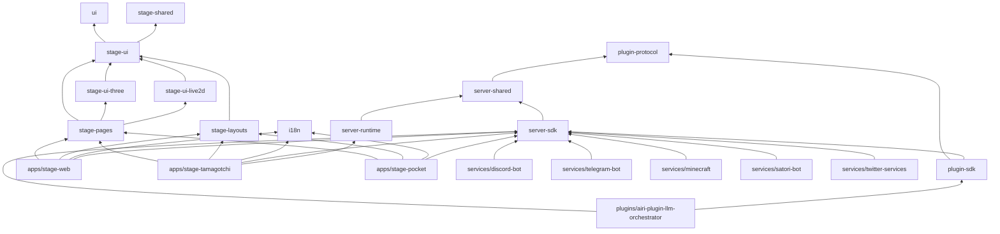

## 11.14 Schéma : flux de données audio-to-audio

```mermaid
flowchart LR
    Mic[🎤 Micro] --> AW[AudioWorklet 48kHz]
    AW --> VAD[VAD Worker Silero]
    VAD -->|speech segment| RESAMP[Resample 16kHz]
    RESAMP --> STT[STT Provider]
    STT --> IT[input:text:voice event]
    IT --> WS[WebSocket]
    WS --> SR[server-runtime]
    SR --> LO[llm-orchestrator]
    LO --> SX[xsai streamText]
    SX --> SRCHK[chunk stream]
    SRCHK --> WS2[WebSocket back]
    WS2 --> CL[server-sdk Client]
    CL --> TTS[Kokoro Worker]
    TTS --> PCM[Float32 PCM + visemes]
    PCM --> PB[Playback Manager]
    PB --> SPK[🔊 Speakers]
    PB --> LS[LipSync driver]
    LS --> VRM[VRM / Live2D mouth params]
    VRM --> CANVAS[🖼 Canvas]
```

---

> **Note** : tous les diagrammes ci-dessus sont au format Mermaid. Ils peuvent être rendus en SVG/PNG via des outils comme [mermaid.live](https://mermaid.live) ou directement par GitHub, VS Code, et la plupart des générateurs de documentation.
